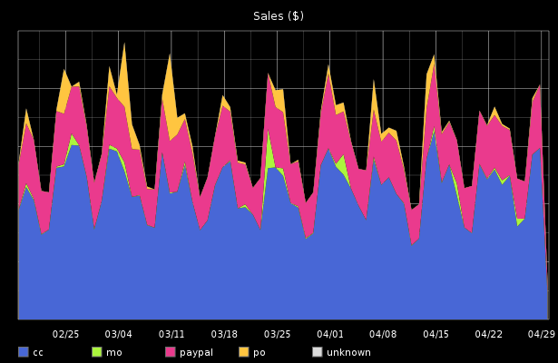
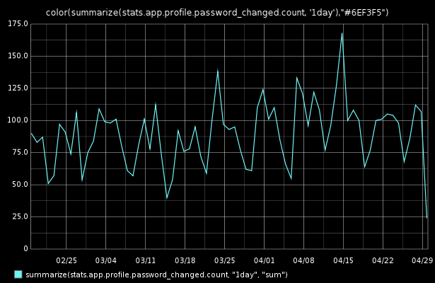
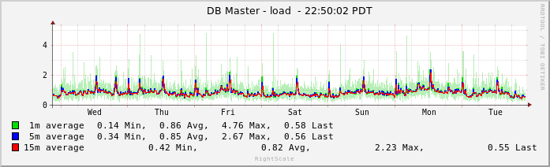
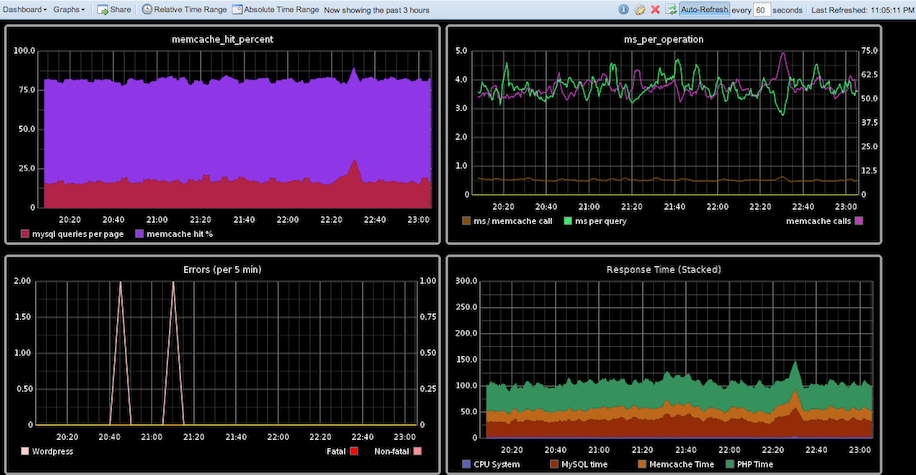

!SLIDE
# Monitoring and Alerting

!SLIDE
## Healthcare.gov
### http://dpaste.com/1756566/#wrap

!SLIDE
> "Nobody could even tell us if the system was up as we were sitting there,
> except by taking out laptops and trying to go on it."

!SLIDE bullets incremental
* **Monitoring** - recording what's going on.
* **Alerting** - letting us know when monitored data indicates a problem.

!SLIDE
> You can't fix what you can't measure.

!SLIDE
# What do we measure?

!SLIDE center
## Business metrics

!SLIDE center
## Application metrics

!SLIDE center
## System metrics

!SLIDE
# What do we use to measure?

!SLIDE
1. It should be easy to get data **in**.
2. It should be easy to get data **out**.

!SLIDE
## Graphite
https://graphite.readthedocs.org/

!SLIDE
## StatsD

    @@@ PHP
    Stats::recordEvent('talk.web-ops');

!SLIDE
## pipe-to-graphite
    @@@ Sh
    # Produce a huge number of stats about mysql
    mysql -u root -e "show global status" |
    # Skip the first line (column headers "Variable_name Value")
    tail -n +2 |
    # lower-case everything because Capitals_with_underscores_are_annoying
    tr '[A-Z]' '[a-z]' |
    # Prepend 'mysql.' and turn a few instances of 'name_' into 'name.' mainly
    # so they are grouped in the Graphite UI
    sed -re "s/^(com|handler|innodb|key|qcache|select|sort|threads)_/\1./" \
         -e "s/^/mysql./" -e "/\S+\s+[0-9.-]+/!d"

!SLIDE center

