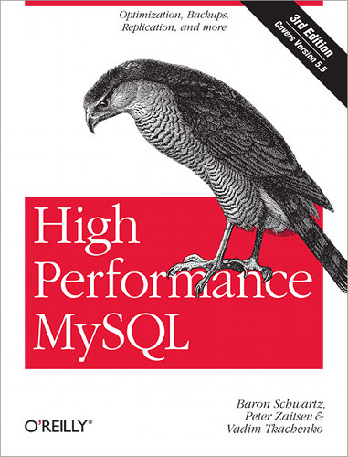
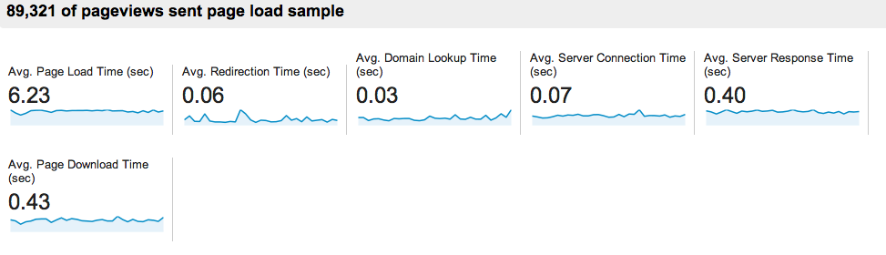

!SLIDE
# Performance

!SLIDE bullets incremental
# Why?
* Security issues (availability)
* More user interaction

!SLIDE bullets incremental
# Response-Time Limits
* 0.1 second feels instantaneous
* 1 second keeps flow seamless
* 10 seconds keeps the user's attention

### http://www.nngroup.com/articles/response-times-3-important-limits/

!SLIDE center

!SLIDE center

github.com/jokkedk/webgrind/

!SLIDE center

github.com/iFixit/memlog

!SLIDE center

!SLIDE center

www.amazon.com/-/dp/1449314287/

!SLIDE
# Frontend

!SLIDE center

yslow.org

!SLIDE center

webpagetest.org

!SLIDE center

google.com/analytics

!SLIDE bullets incremental
# Scaling
* Big-O

